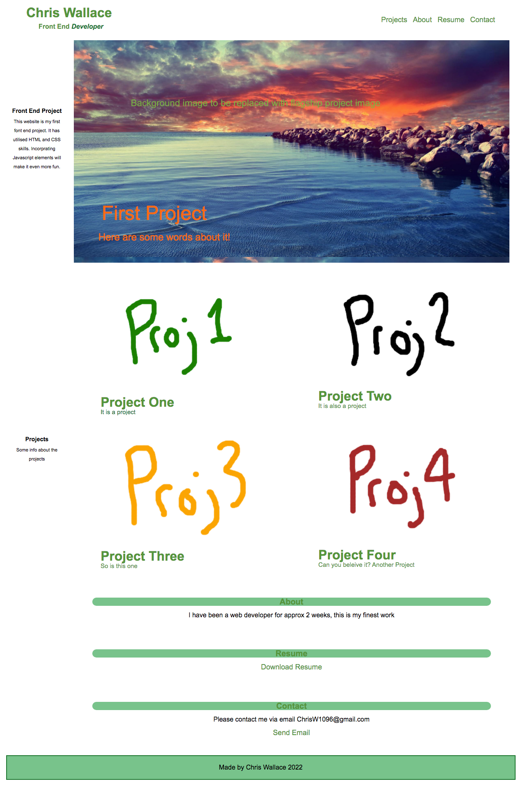

# my-projects-website#
***
Title: My Projects Website
***
Description: Landing page for My Website. 
***
Purpose: A website is a smart and efficent way of showcasing the work of any full stack developer.
This landing page will display my best work/projects over the coming months.
***
Motivation: As my goal in this course is to gain a position as a remote back-end developer, this landing page and its contents should help me achive that. Showcasing both front end and back end skills in the near future. 
***
Deployment: When the HTML and CSS files are displayed by any browser the code should appear as indicated by this example image: 
The page can also be access via the folowing url: https://wollemipines.github.io/my-projects-website/ 
***
Changes: None, this is the first edtion. 
***
Credit: Background image can be creditied to https://www.pixelstalk.net/wp-content/uploads/2016/11/Calm-Desktop-Wallpaper.jpg 